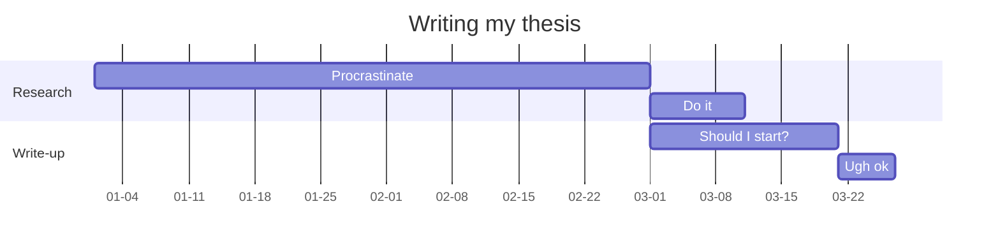
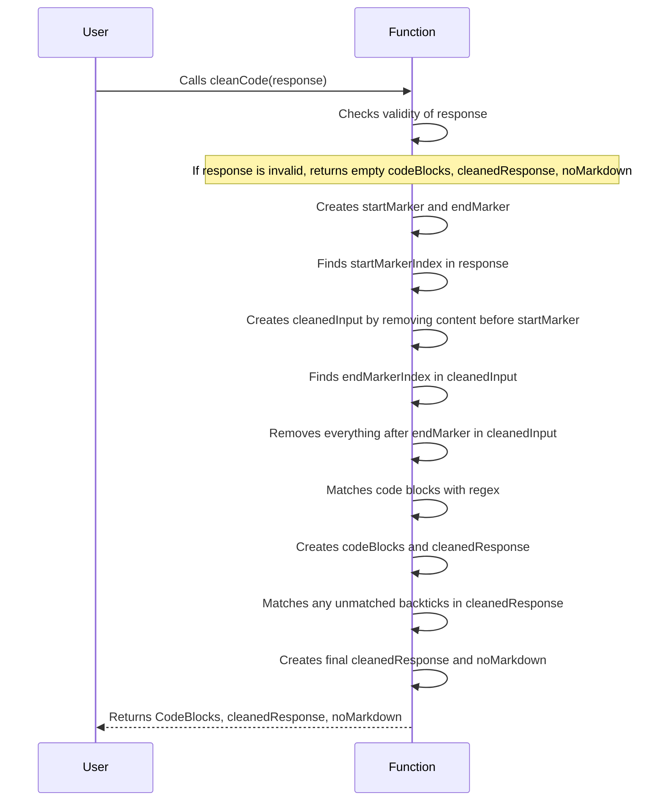

# <a id="memory-extension-web-app"></a>Memory Extension Web App
This project aims to simulate human memory processes to provide long-term memory support for ChatGPT, particularly when dealing with complex tasks such as coding a large application.

- [Memory Extension Web App](#memory-extension-web-app)
- [How to send?](#how-to-send)
- [Examples](#examples)
- [Target Audience](#target-audience)
- [License](#license)

### <a id="how-to-send"></a>How to send?

particularly when dealing with complex tasks such as coding a large application.
swagger-setup-on-express-api
<div class='mdc'>
<div class='ic'>

```javascript
function hashToLink(doclet, hash) {
  var url

  if ( !/^(#.+)/.test(hash) ) {
    return hash
  }

  url = helper.createLink(doclet)
  url = url.replace(/(#.+|$)/, hash)

  return '<a href="' + url + '">' + hash + '</a>'
}
```

</div>
<div class='ic'>



</div>
</div>

| Item              | In Stock | Price |
| :---------------- | :------: | ----: |
| Python Hat        |   True   | 23.99 |
| SQL Hat           |   True   | 23.99 |
| Codecademy Tee    |  False   | 19.99 |
| Codecademy Hoodie |  False   | 42.99 |

## <a id="examples"></a>Examples

<div class="mdc">
<div calss="ic">

Here are some examples of how to use this project:

- To authenticate a user, use the NextAuth library.
- To manage state, use the Redux RTK Query library.
- To style the UI, use the Tailwind library.
- To store data, use the PostgreSQL database.
- To document the API, use the Swagger library.

</div>
<div class="ic" width="50%">



</div>
</div>

## <a id="target-audience"></a>Target Audience

This project is intended for developers who use ChatGPT and need long-term memory support for complex tasks such as coding a large application.


## <a id="license">License

This project is licensed under the MIT License. See the LICENSE file for details.