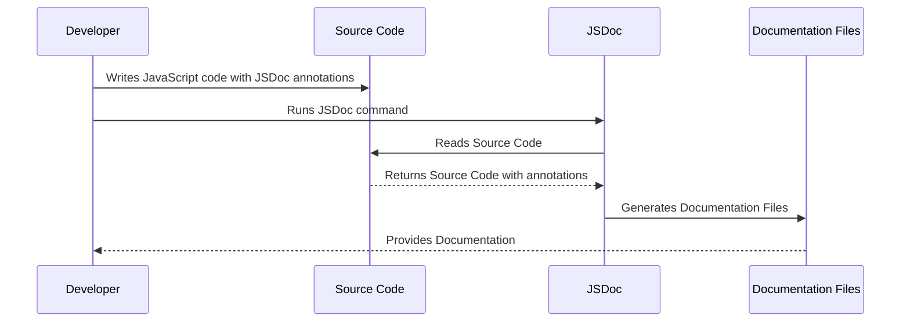

# jsdoc

JSDoc is a markup language used to annotate JavaScript code, much like JavaDoc is for Java and phpDocumentor for PHP. Using comments in your code, you can provide rich, detailed documentation that describes the functionality and usage of your JavaScript code. This is particularly useful for large codebases and APIs where the purpose and usage of functions and methods may not be immediately clear.

JSDoc comments start with `/**` and end with `*/`. Within these comments, you can use tags to provide more detailed information. Here are some essential tags:

- `@param {type} name description`: Documents a parameter passed into a function.
- `@returns {type} description`: Documents what a function returns.
- `@class`: Documents that a function is a constructor or a class.
- `@module`: Indicates that the file is a module.
- `@property {type} name description`: Describes a property of an object, typically used within a @class or @module block.

Here's an example of how you might use JSDoc in a JavaScript function:

```javascript
/**
 * Adds two numbers together.
 * @param {number} num1 The first number.
 * @param {number} num2 The second number.
 * @returns {number} The sum of the two numbers.
 */
function add(num1, num2) {
    return num1 + num2;
}
```

In addition to this, JSDoc can be used to generate a static HTML documentation site from your comments. JSDoc supports custom templates and can be extended with plugins, making it a powerful and flexible option for documenting your JavaScript projects.

## How it is used?

to describe how it works, here's a simple sequence diagram for a typical JSDoc workflow:



This diagram describes the following process:

1. The developer writes JavaScript code with JSDoc annotations.
2. The developer runs the JSDoc command (usually through a command line interface).
3. JSDoc reads the source code, including any annotations.
4. The source code returns its contents, including JSDoc comments, to the JSDoc tool.
5. JSDoc generates documentation files (typically HTML) based on the code and comments.
6. The developer then uses these documentation files for understanding, maintaining, or sharing the functionality of the code.


I would recommend checking the [official JSDoc website](https://jsdoc.app/).